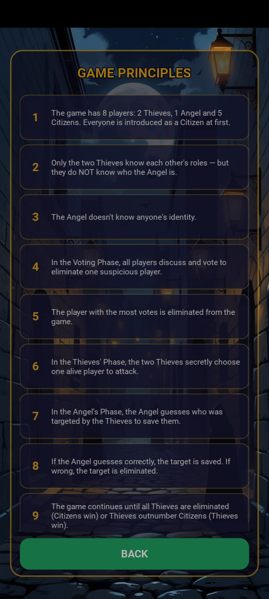
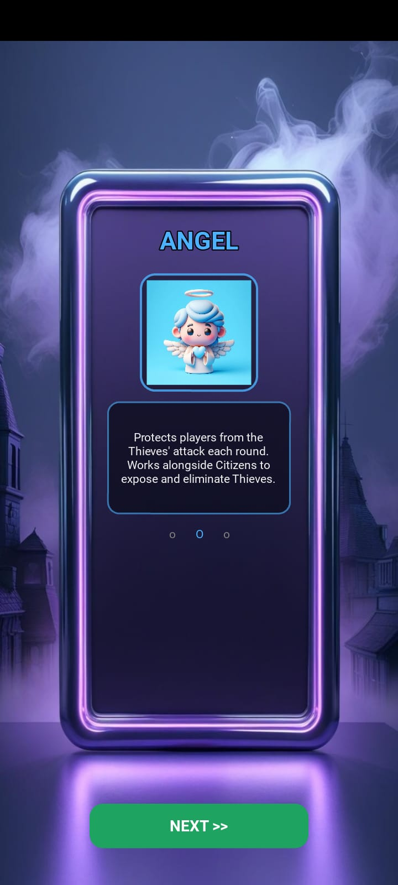
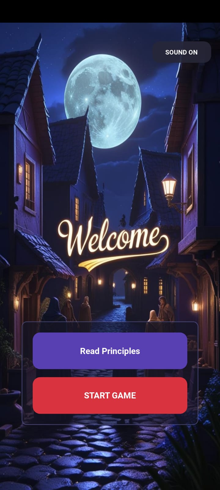
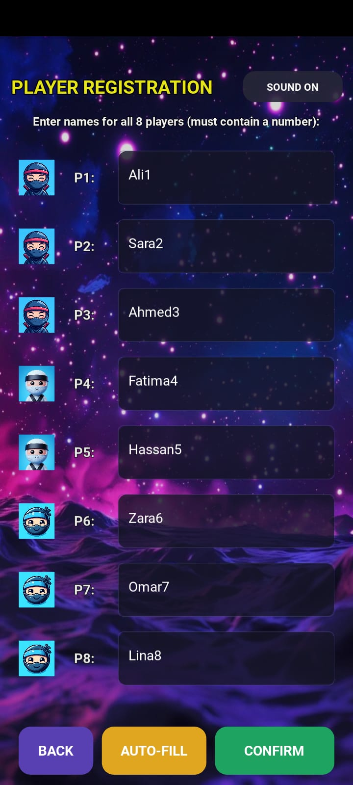
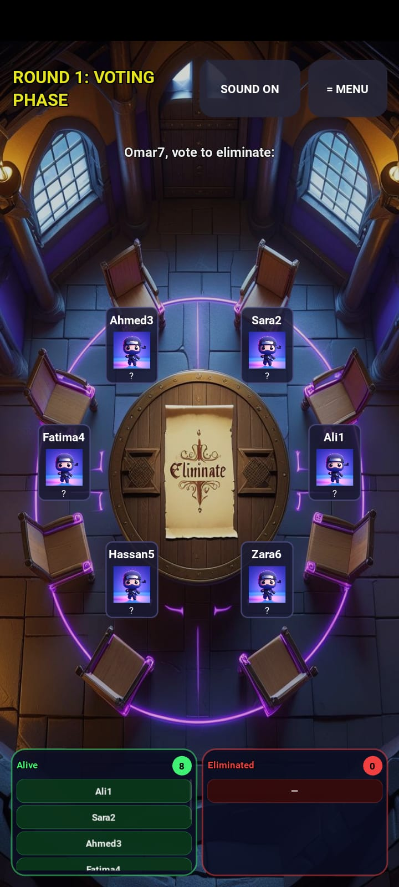
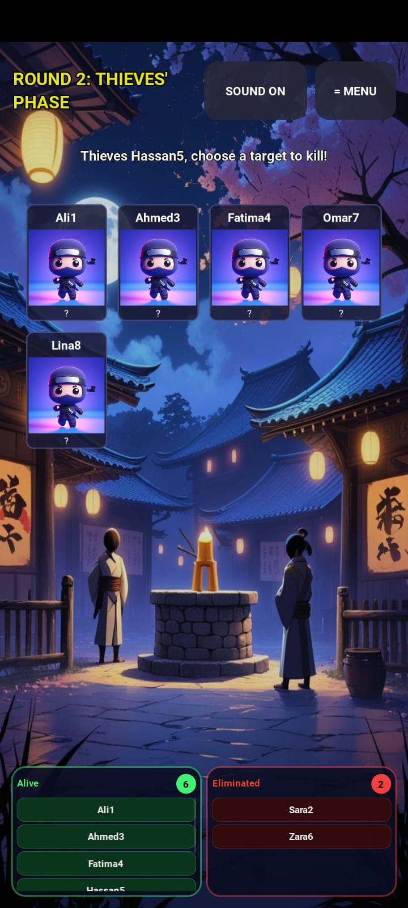
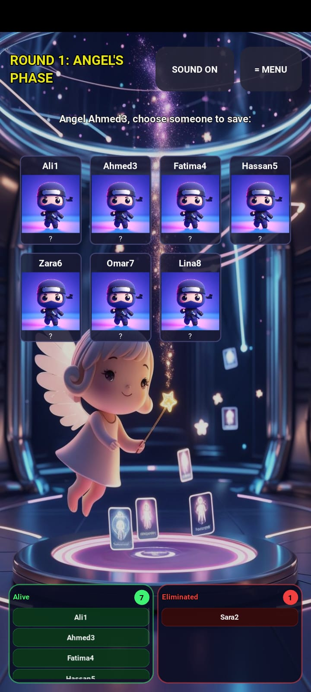
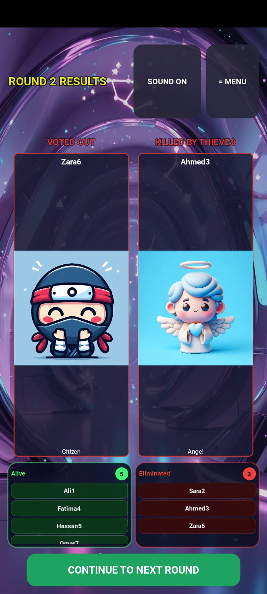
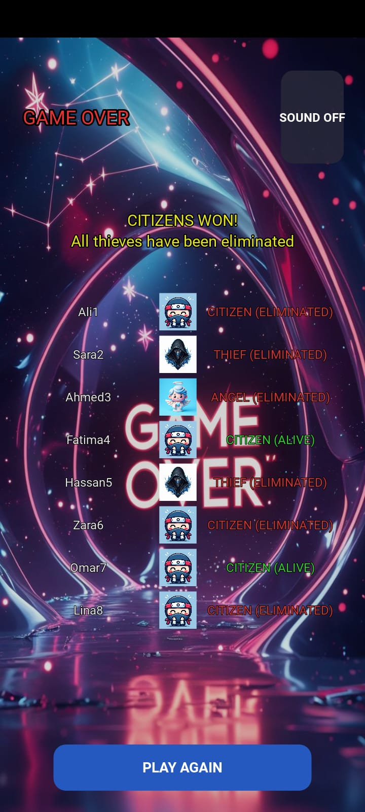

# Dakati Game - A Dacoit Themed Social Deduction Game

[](https://www.python.org/)
[](https://kivy.org/)
[](https://kivy.org/)

[]()
[]()
[]()

---

Dakati Game is a professional social deduction mobile game developed as a **course project for Algorithms Analysis**. Players are assigned secret roles (Thieves, Angel, Citizens) and must use deduction, strategy, and deception to achieve their faction's victory. The game features a unique voting system, night phase actions, and real-time role reveals. Built with **Kivy** framework for cross-platform compatibility (Android, iOS, Windows, macOS).

---

## Table of Contents
- [About the Game](#about-the-game)
- [Course Context](#course-context)
- [Key Features](#key-features)
- [Game Mechanics](#game-mechanics)
- [Use Case](#use-case)
- [Technology Stack](#technology-stack)
- [Data Structures](#data-structures)
- [Algorithms Used](#algorithms-used)
- [Installation Guide](#installation-guide)
- [Game Flow](#game-flow)
- [Phase Details](#phase-details)
- [Project Structure](#project-structure)
- [Sound & Music](#sound--music)
- [Mobile Deployment](#mobile-deployment)
- [Future Improvements](#future-improvements)
- [Developed By](#developed-by)

---

## About the Game

| Aspect | Description |
|:-------|:------------|
| **What it is** | A social deduction game where players take on secret roles (Thieves, Angel, Citizens) and must eliminate opposing factions through voting and strategic night actions |
| **Who can play** | 8 players per game session, suitable for friends, families, and party game enthusiasts |
| **Problem it solves** | Provides a digital platform for the popular social deduction genre with automated role management, elimination tracking, and phase-based gameplay |
| **Main features** | Role reveal animations, circular voting interface, thieves' secret targeting, angel protection phase, real-time elimination history, glass morphism UI |

---

## Screenshots

We have included screenshots highlighting the premium glassmorphic user interface and phase-based game flow:

| Welcome Screen | Principles Screen | Role Showcase |
| :---: | :---: | :---: |
|  |  |  |

| Player Registration | Voting Phase |
| :---: | :---: |
|  |  |

| Thieves' Phase | Angel's Phase | Results Phase |
| :---: | :---: | :---: |
|  |  |  |

| Game Over Screen |
| :---: |
|  |

---

## Course Context

This project was developed to fulfill the **requirements of the Algorithms Analysis course** in the **4th Semester of BS Computer Science**.

| Course Component | Implementation in This Project |
|:----------------|:-------------------------------|
| **Algorithm Design** | Dynamic player positioning using trigonometric algorithms (sine/cosine for circular layouts) |
| **String Matching** | Player name validation with digit requirement checking |
| **Data Structures** | Dictionaries for player data, lists for vote tracking, sets for unique name validation |
| **Sorting & Searching** | Vote tallying with max value detection, candidate selection algorithms |
| **Complexity Analysis** | O(n) vote processing, O(n²) player card layout algorithms |
| **State Management** | Phase-based state machine with 6 distinct game phases |

> This project demonstrates practical application of algorithmic concepts including circular layout algorithms, state machine design, and efficient data structure usage for real-time game state management.

---

## Key Features

### Gameplay
- 8-player social deduction with 3 unique roles (2 Thieves, 1 Angel, 5 Citizens)
- Secret role assignment with individual role reveal screens
- Day voting phase with circular elimination interface
- Night thieves' phase with secret targeting
- Angel protection phase with save mechanics
- Real-time elimination tracking and history

### User Interface
- Glass morphism design with semi-transparent cards
- Circular player positioning using trigonometric calculations
- Dynamic grid layouts for phase-specific displays
- Custom animated buttons with scale effects

### Audio System
- Phase-based background music (detect, suspense, thieves, angel tracks)
- Mute/unmute functionality across all screens
- Seamless music transitions between game phases

### Mobile Optimization
- dp() (density-independent pixels) for responsive sizing
- size_hint and pos_hint for adaptive layouts
- ScrollView integration for overflow content
- Soft input mode for keyboard handling
- Portrait orientation lock

### Data Management
- Player registration with validation (unique names, digit requirement)
- Game history tracking with round-by-round events
- Elimination recording (voting vs night elimination)

---

## Game Mechanics

### Roles

| Role | Count | Win Condition | Special Ability |
|:-----|:------|:--------------|:----------------|
| Thief | 2 | Outnumber remaining players | Secretly choose a target each night |
| Angel | 1 | Citizens win | Guess thieves' target to save |
| Citizen | 5 | All thieves eliminated | Vote during day phase |

### Phase Structure

| Phase | Description | Duration |
|:------|:------------|:---------|
| Registration | 8 players enter names with numbers | User controlled |
| Role Reveal | Each player sees their secret role | 8 screens |
| Voting Phase | Players vote to eliminate suspicious player | 8 votes |
| Thieves Phase | Thieves secretly choose elimination target | 1 selection |
| Angel Phase | Angel guesses who thieves targeted | 1 selection |
| Results Phase | Elimination results displayed | Until continue |
| Game Over | Victory screen with role summary | End game |

### Elimination Rules
- Player with most votes eliminated (random tiebreaker)
- If Angel guesses correctly, target is saved
- If Angel guesses incorrectly, target is eliminated
- Game continues until thieves outnumber citizens or all thieves eliminated

---

## Use Case

A group of 8 friends can:

1. Launch the game on their respective devices
2. Register unique names (must contain numbers for identification)
3. Learn their secret roles through individual reveal screens
4. Discuss during voting phase to identify suspicious players
5. Cast votes to eliminate suspected thieves
6. Experience the night phase where thieves secretly target a player
7. Watch the angel attempt to save the targeted player
8. Continue through rounds until one faction wins
9. Review the elimination history and final role distribution

---

## Technology Stack

### Framework

| Technology | Badge |
|:-----------|:------|
| Language: Python 3.9+ | [](https://www.python.org/) |
| GUI Framework: Kivy 2.0+ | [](https://kivy.org/) |

### UI Components

| Technology | Description |
|:-----------|:------------|
| Graphics | Kivy Canvas for custom drawing |
| Animations | Kivy Animation framework |
| Layouts | BoxLayout, FloatLayout, GridLayout |
| Styling | KV Language for UI design |

### Audio

| Technology | Description |
|:-----------|:------------|
| Audio | Kivy SoundLoader |
| Audio Files | MP3 format support |

### Mobile Packaging

| Platform | Tool |
|:---------|:-----|
| Android | Buildozer |
| iOS | Kivy-iOS |
| Windows/Mac | PyInstaller |

---

## Data Structures

### Player Data Structure (In-Memory Dictionary)

| Key | Type | Description |
|-----|------|-------------|
| name | String | Player identifier |
| role | String | Thief/Angel/Citizen |
| alive | Boolean | Elimination status |
| role_icon | String | Image path reference |
| known_thieves | List | Thief partner reference |

### Game History Structure (List of Dictionaries)

| Field | Type | Description |
|-------|------|-------------|
| round | Integer | Round number |
| phase | String | Phase name |
| event | String | Event description |

### Player Lists

| List | Description |
|------|-------------|
| alive_players | Current active players |
| eliminated_players | Removed players |
| player_names | All registered names |
| current_votes | Dictionary of vote counts (defaultdict(int)) |

---

## Algorithms Used

### Circular Layout Algorithm

```python
def layout_cards(instance, value):
    center_x = instance.width / 2
    center_y = instance.height / 2
    radius = min(instance.width, instance.height) * 0.36
    
    angle_step = 360 / num_options
    
    for idx, card_widget in enumerate(cards):
        angle = math.radians(idx * angle_step)
        x = center_x + radius * math.cos(angle) - card_width/2
        y = center_y + radius * math.sin(angle) - card_height/2
        
        card_widget.size = (card_width, card_height)
        card_widget.pos = (instance.x + x, instance.y + y)
```

### Vote Processing Algorithm

| Step | Complexity |
|------|------------|
| Vote collection per player | O(n) |
| Max vote detection | O(n) |
| Candidate selection | O(m) where m ≤ n |
| Random tiebreaker | O(1) |

### Role Assignment Algorithm

- Random shuffle of 8 roles using random.shuffle()
- O(n) distribution to players
- Thief partner linking O(k) where k = number of thieves (2)

### Dynamic Card Sizing

```python
if num_options > 5:
    scale_factor = 0.9 - (min(num_options, 8) - 5) * 0.08
    card_width = base_card_width * scale_factor
    card_height = base_card_height * scale_factor
```

### Name Validation Algorithm

- Empty string check: O(1)
- Digit presence check using any() function: O(m) where m is name length
- Uniqueness check using set comparison: O(n)

---

## Installation Guide

### Prerequisites
- Python 3.8 or higher
- pip package manager

### Step 1: Download the Project

Download the main.py file and create an assets folder with all required images.

### Step 2: Install Kivy and Dependencies

```bash
pip install kivy
pip install kivy[full]
```

### Step 3: Verify Assets Directory

Ensure the following folder structure exists:

```
dakati-game/
├── assets/
│   ├── thief_icon.png
│   ├── angel_icon.png
│   ├── citizen_icon.png
│   ├── question_mark.png
│   ├── default_bg.jpg
│   ├── register_bg.jpg
│   ├── role_reveal_bg.jpg
│   ├── voting_bg.jpg
│   ├── thieves_bg.jpg
│   ├── angel_bg.jpg
│   ├── results_bg.jpg
│   ├── gameover_bg.jpg
│   ├── principles_bg.jpg
│   ├── roles_bg.jpg
│   ├── slide1.jpg through slide7.jpg
│   └── player_1.png through player_8.png
├── detect.mp3
├── suspense.mp3
├── thieves.mp3
├── angel.mp3
└── main.py
```

### Step 4: Run the Game

```bash
python main.py
```

### Step 5: Mobile Build (Android)

```bash
pip install buildozer
buildozer init
# Edit buildozer.spec file
buildozer -v android debug
```

---

## Game Flow

| Step | Phase | Description |
|:----:|:------|:------------|
| 1 | Welcome Screen | Slideshow background with glass morphism buttons |
| 2 | Role Introduction | Players view Thief/Angel/Citizen descriptions |
| 3 | Registration | 8 players enter names (must contain numbers, unique) |
| 4 | Role Reveal | Each player sees their secret role with description |
| 5 | Voting Phase | Circular interface, sequential voting |
| 6 | Thieves Phase | Secret target selection by thieves |
| 7 | Angel Phase | Protection guess by angel |
| 8 | Results Phase | Elimination display |
| 9 | Game Over | Victory screen with role summary |

Steps 5-8 repeat until win condition is met.

---

## Phase Details

### Voting Phase

| Aspect | Details |
|--------|---------|
| Interface | Circular layout with dynamic positioning |
| Voting | Sequential voting by alive players |
| Restrictions | Thieves cannot vote for each other |
| Tiebreaker | Random selection among highest votes |
| Outcome | Player eliminated (Citizen/Thief/Angel) |

### Thieves Phase

| Aspect | Details |
|--------|---------|
| Participants | Alive Thieves only |
| Target Options | All non-thief players |
| Interface | Grid layout with dynamic sizing |
| Outcome | Target selected for elimination |

### Angel Phase

| Aspect | Details |
|--------|---------|
| Participant | Angel (if alive) |
| Target Options | All alive players |
| Interface | Grid layout with cards |
| Success | Target saved if guessed correctly |
| Failure | Target eliminated if guess wrong |

### Results Phase

| Aspect | Details |
|--------|---------|
| Display | Shows voted-out and killed players |
| Victory Check | Compare thieves vs citizens count |
| Continue | Button to proceed to next round |

---

## Project Structure

```
DakatiGame/
│
├── main.py                      # Main application with all game logic
│
├── assets/
│   ├── thief_icon.png                  # Thief role icon
│   ├── angel_icon.png                  # Angel role icon
│   ├── citizen_icon.png                # Citizen role icon
│   ├── question_mark.png               # Hidden role indicator
│   ├── eliminated.png                  # Elimination animation
│   ├── thief_died.png                  # Thief death indicator
│   ├── angel_died.png                  # Angel death indicator
│   ├── angel_saved.png                 # Angel save animation
│   ├── citizen_died.png                # Citizen death indicator
│   │
│   ├── default_bg.jpg                  # Default background
│   ├── register_bg.jpg                 # Registration background
│   ├── role_reveal_bg.jpg              # Role reveal background
│   ├── voting_bg.jpg                   # Voting phase background
│   ├── thieves_bg.jpg                  # Thieves phase background
│   ├── angel_bg.jpg                    # Angel phase background
│   ├── results_bg.jpg                  # Results background
│   ├── gameover_bg.jpg                 # Game over background
│   ├── principles_bg.jpg               # Principles background
│   ├── roles_bg.jpg                    # Roles showcase background
│   │
│   ├── slide1.jpg through slide7.jpg   # Welcome slideshow images
│   └── player_1.png through player_8.png # Player number icons
│
├── detect.mp3                          # General background music
├── suspense.mp3                        # Voting phase music
├── thieves.mp3                         # Thieves phase music
├── angel.mp3                           # Angel phase music
│
├── buildozer.spec                      # Android build configuration
│
└── bin/                                # Generated APK output directory
```

---

## Sound & Music

### Audio Tracks

| Track | File Name | Phase |
|-------|-----------|-------|
| General BGM | detect.mp3 | Welcome, Registration, Role Reveal, Results, Game Over |
| Suspense | suspense.mp3 | Voting Phase |
| Stealth | thieves.mp3 | Thieves Phase |
| Hopeful | angel.mp3 | Angel Phase |

### Audio Implementation

```python
def update_music(self, phase=None):
    if self.music_muted:
        self.stop_music()
        return
    
    if phase == "VOTING":
        track = "suspense.mp3"
    elif phase == "THIEVES":
        track = "thieves.mp3"
    elif phase == "ANGEL":
        track = "angel.mp3"
    else:
        track = "detect.mp3"
    
    self.current_sound = SoundLoader.load(track)
    self.current_sound.loop = True
    self.current_sound.play()
```

---

## Mobile Deployment

### Android Build (Buildozer)

1. Initialize buildozer:
```bash
buildozer init
```

2. Edit buildozer.spec:
```ini
title = Dakati Game
package.name = dakati
package.domain = org.dakati
source.dir = .
source.include_exts = py,png,jpg,kv,atlas,mp3
version = 1.0.0
requirements = python3,kivy
orientation = portrait
fullscreen = 1
android.permissions = INTERNET
android.api = 30
android.ndk = 23b
```

3. Build APK:
```bash
buildozer -v android debug
```

### iOS Build

```bash
git clone git://github.com/kivy/kivy-ios
cd kivy-ios
./toolchain.py build python3 kivy
./toolchain.py create DakatiGame /path/to/dakati_game
```

### Windows/Mac Build (PyInstaller)

```bash
pip install pyinstaller
pyinstaller main.py -w --onefile
```

---

## Future Improvements

- Online multiplayer with networking support
- Player chat system during voting phase
- Customizable player avatars
- Sound effects for button presses and eliminations
- Tutorial mode for new players
- Additional roles (Detective, Healer, Clown)
- Save game state and resume functionality
- Leaderboards and statistics tracking
- Voice chat integration
- Themed visual effects for each role
- Difficulty levels with time limits for voting
- Replay system for game review

---

## Developed By

| | |
|:---|:---|
| **Developer Name** | Alina Liaquat |
| **Supervisor Name** | Faisal Hafeez |
| **GitHub** | precious-05 |
| **Email** | alina.insights@gmail.com |
| **Class & Semester** | BS Computer Science - 4th Semester |
| **Department** | Department of Computer Science |
| **Course** | Algorithms Analysis |
| **LinkedIn** | alina-liaquat-779347325 |

---

<div align="center">

Dakati Game - A Dacoit Themed Social Deduction Game

Improving social gaming experiences through algorithmic game design

---

This project was submitted in partial fulfillment of the requirements for the Algorithms Analysis course.

</div>
